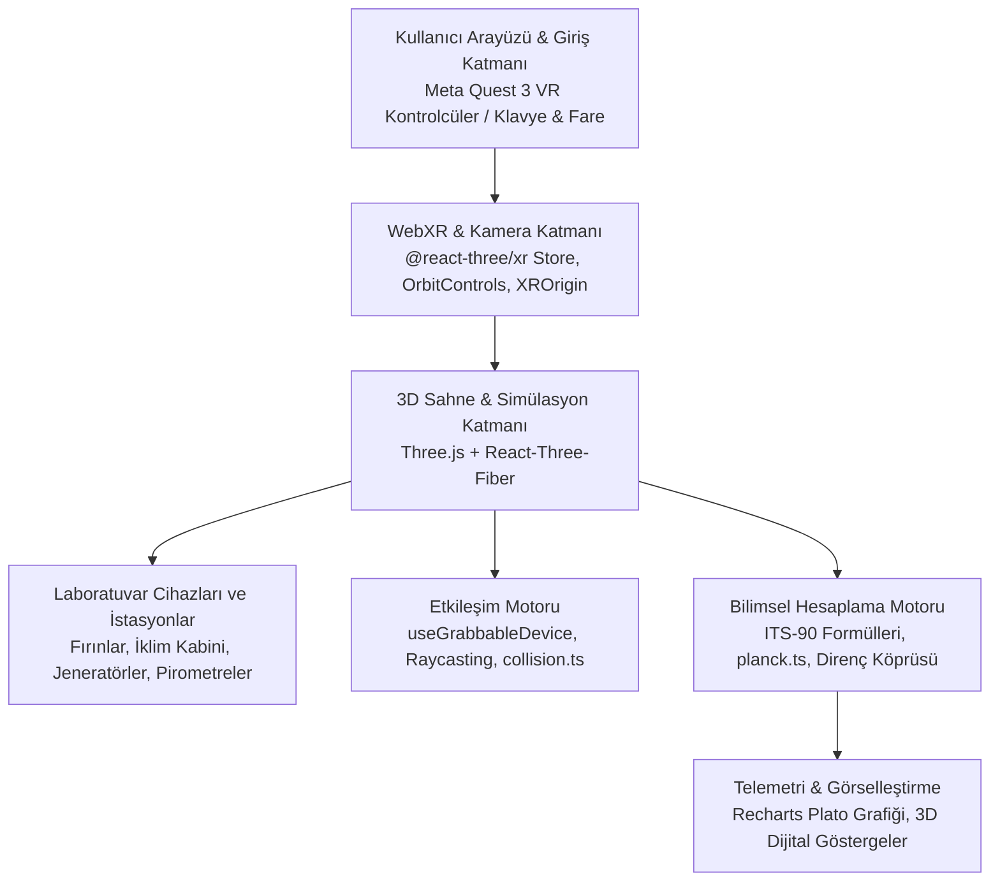

# ThermoLab: Teknoloji Altyapısı ve Sistem Mimarisi Raporu 🔬🌡️

Bu doküman, **ThermoLab (WebXR Sıcaklık & Nem Metroloji Laboratuvarı)** projesinin çekirdek yazılım teknolojilerini, 3D/VR altyapısını, bilimsel ve metrolojik hesaplama modellerini, donanım entegrasyonlarını ve sistem mimarisini ayrıntılı olarak açıklamaktadır.

---

## 1. Proje Genel Bakışı

**ThermoLab**, uluslararası metroloji ve kalibrasyon standartlarını (**ITS-90 Sıcaklık Ölçeği**, bağıl nem/çiy noktası termodinamiği ve optik radyasyon fiziği) web tarayıcılarına ve **Sanal Gerçeklik (WebXR / Meta Quest 3)** ortamına taşıyan yüksek hassasiyetli bir 3D laboratuvar simülasyonudur.

- **Geliştirici:** Mücahit Korkmaz ([@mchtkrkmz](https://github.com/mchtkrkmz))
- **Referans Kurum / İlham:** TÜBİTAK UME (Ulusal Metroloji Enstitüsü) Standartları
- **Erişim Modeli:** İstemci taraflı (Client-side) çalışan, harici sunucu bağımlılığı olmayan, hem masaüstü tarayıcılarda (fare/klavye) hem de bağımsız VR başlıklarda çalışan çapraz platform Web uygulaması.

---

## 2. Kullanılan Teknolojiler ve Görev Dağılımı

| Kategori | Teknoloji / Kütüphane | Sürüm | Kullanım Amacı ve İşlevi |
| :--- | :--- | :--- | :--- |
| **Çekirdek Çatı** | **React** | `19.2.8` | Bileşen tabanlı reaktif UI mimarisi, state yönetimi, custom hook'lar ve yaşam döngüsü kontrolü. |
| **Tip Güvenliği** | **TypeScript** | `~6.0.2` | Metrolojik formüller, 3D vektör/matris tipleri ve cihaz durumları için statik tip kontrolü. |
| **Yapılandırma & Sunucu** | **Vite** | `^8.2.2` | Ultra hızlı ES-modül tabanlı geliştirme sunucusu (HMR) ve optimize edilmiş üretim derlemesi (Bundler). |
| **SSL / Güvenlik** | **@vitejs/plugin-basic-ssl**| `^2.3.0` | WebXR oturumlarının gerektirdiği HTTPS/TLS sertifikasını yerel ağda otomatik üretme. |
| **3D Grafik Motoru** | **Three.js** | `^0.185.1` | WebGL 2.0 tabanlı düşük seviyeli 3D render motoru, sahne grafı (scene graph), materyaller ve matrisler. |
| **React 3D Sarmalayıcı**| **@react-three/fiber (R3F)**| `^9.7.0` | Three.js nesnelerini deklaratif JSX bileşenlerine dönüştüren ve 90 FPS render döngüsünü (`useFrame`) yöneten çatı. |
| **3D Yardımcılar** | **@react-three/drei** | `^10.7.8` | Kamera kontrolleri (`OrbitControls`), 3D metinler (`Text`), yükleme göstergeleri ve 3D yardımcı öğeler. |
| **Sanal Gerçeklik (VR)** | **@react-three/xr** | `^6.6.30` | WebXR Device API entegrasyonu, Quest 3 kontrolcü/el takibi (Hand Tracking), teleportasyon ve locomotion. |
| **Fizik Motoru (Ops.)** | **@react-three/rapier** | `^2.2.0` | WebAssembly tabanlı Rapier 3D fizik motoru entegrasyonu. |
| **Veri Görselleştirme** | **Recharts** | `^3.10.1` | ITS-90 sabit nokta plato faz geçişlerini milikelvin ($mK$) hassasiyetinde çizdiren telemetri grafikleri. |
| **Arayüz İkonları** | **Lucide React** | `^1.41.0` | Modern, vektörel 2D ve 3D kontrol paneli simgeleri. |
| **Kod Denetimi** | **Oxlint** | `^1.79.0` | Rust tabanlı, yüksek hızlı JavaScript/TypeScript linter aracı. |

---

## 3. Sistem ve Katman Mimarisi

Uygulama 4 ana mimari katmandan meydana gelir:



---

## 4. Ayrıntılı Teknoloji Analizi

### 4.1. 3D ve WebXR Entegrasyonu (@react-three/fiber & @react-three/xr)
- **WebXR Device API Desteği:** Meta Quest 3, Quest Pro, Quest 2 ve WebXR destekleyen tarayıcılar (Oculus Browser, Chrome Android vb.) doğrudan tanınır.
- **`createXRStore`:** VR oturumu başlatma, çıkış yapma ve oturum durumunu merkezi bir store üzerinden yönetir.
- **Locomotion (Kullanıcı Hareketi):**
  - **Thumbstick Kontrolü:** Sol analog kol ile serbest yürüme (`useXRControllerLocomotion`).
  - **Snap Turn:** Sağ analog kol ile 45° açılı kesintili dönüşler (VR simülasyon bulantısını önler).
  - **Teleportasyon:** Kontrolcüler ve el takibinde (`hand`) lazer pointer ile zemin üzerine ışınlanma desteği.
- **El Takibi (Hand Tracking):** Kontrolcü olmadan doğrudan çıplak ellerle lazer işaretleme ve buton tetikleme imkanı.
- **Klavye & Masaüstü Modu:** Cihaza bağlı VR başlığı yoksa `OrbitControls` devreye girerek laboratuvarda fare ile 360° serbest inceleme sağlar.

### 4.2. Bilimsel ve Metrolojik Hesaplama Altyapısı

#### A. ITS-90 Birincil Seviye Sabit Noktalar (Fixed Points)
Uluslararası Sıcaklık Ölçeği (ITS-90) gereğince faz dönüşüm sıcaklıkları yüksek saflıktaki metaller ve sıvılarla simüle edilmiştir:
- **Hg (Cıva Üçlü Noktası):** $-38.8344\ ^\circ\text{C}$
- **TPW (Su Üçlü Noktası):** $+0.0100\ ^\circ\text{C}$
- **Ga (Galyum Erime Noktası):** $+29.7646\ ^\circ\text{C}$
- **In (İndiyum Donma Noktası):** $+156.5985\ ^\circ\text{C}$
- **Sn (Kalay Donma Noktası):** $+231.928\ ^\circ\text{C}$
- **Zn (Çinko Donma Noktası):** $+419.527\ ^\circ\text{C}$
- **Al (Alüminyum Donma Noktası):** $+660.323\ ^\circ\text{C}$
- **Ag (Gümüş Donma Noktası):** $+961.78\ ^\circ\text{C}$

Sabit noktalara SPRT (Standart Platin Direnç Termometresi) daldırıldığında, gerçek zamanlı faz geçiş platosu (Plateau) oluşur.

#### B. Planck Işınım Yasası ve Radyasyon Termometrisi (`src/utils/planck.ts`)
Temassız sıcaklık ölçümü yapan optik pirometreler ve termal kameralar için Planck Işınım Yasası çalıştırılır:
$$L(\lambda, T) = \frac{c_1}{\pi \cdot \lambda^5 \cdot \left(\exp\left(\frac{c_2}{\lambda \cdot T}\right) - 1\right)}$$
- **Sabitler:** $c_1 = 1.1910428 \times 10^8\ \text{W}\cdot\mu\text{m}^4/(\text{m}^2\cdot\text{sr})$, $c_2 = 14387.77\ \mu\text{m}\cdot\text{K}$
- **Ters Planck Hesaplaması:** Ölçülen spektral radyans değerinden hedef yüzeyin radyans sıcaklığı ($T_K$) logaritmik formülle tersine çevrilerek türetilir.
- **Emisyon Oranı Düzeltmesi ($\varepsilon$):** Yüzeyin emisyonu ile cihazın ayarlı emisyon katsayısı arasındaki fark ve ortam yansımaları ($T_{amb}$) hesaplamaya dahil edilir.

#### C. Nem ve İklimlendirme Metrolojisi
- **İklimlendirme Kabini (ZHL_AKBLT G1TD):** Bağımsız sıcaklık ve bağıl nem profili simülasyonu.
- **Referans Çiy Noktası Aynaları (Chilled Mirror Dew Point Meters):** 2-Basınçlı referans nem jeneratörleri (Thunder Scientific 2900 ve 3920) ile nem kalibrasyonu.
- **KEC Müşteri Cihazları (1, 2, 3):** Kalibrasyona gelen cihazların bağımsız sapma ($\Delta T, \Delta RH$) davranışları.

### 4.3. Etkileşim ve Mekanik Altyapı (`useGrabbableDevice` & `collision.ts`)
- **6 Serbestlik Dereceli (6-DoF) Tutma & Bırakma:**
  - `src/hooks/useGrabbableDevice.ts` hook'u; pirometreler, problar ve termal kameraların VR kontrolcüye ya da fareye kenetlenmesini sağlar.
  - Cihaz bırakıldığında yumuşak bir interpolasyon (Lerp) ile laboratuvardaki orijinal yerine geri döner.
- **Lazer Hedefleme ve Raycasting:**
  - Tutulan cihazın namlusundan 3D uzaya bir ışın (Ray) fırlatılır.
  - Işının çarptığı nesne (fırın, kara cisim, kabin içi) tespit edilir ve o nesnenin gerçek sıcaklığı ölçülerek cihaz ekranında gösterilir.
- **Kullanıcı Çarpışma ve Sınır Denetimi (`src/utils/collision.ts`):**
  - Laboratuvardaki masalar, kabinler ve fırın istasyonları için AABB (Eksen Hizalı Sınırlayıcı Kutu) çarpışma engelleri tanımlanmıştır.
  - Kullanıcı masaların veya cihazların içinden geçemez; duvar sınırları korunur.

### 4.4. Ağ, Güvenlik ve Sunucu Altyapısı
- **HTTPS Zorunluluğu:** WebXR standardı, tarayıcı güvenlik politikaları gereğince **kesinlikle güvenli bağlantı (HTTPS)** talep eder (yalnızca `localhost` istisnadır).
- **`@vitejs/plugin-basic-ssl`:** Geliştirme aşamasında bilgisayarınızın yerel IP adresi üzerinden Meta Quest başlığıyla bağlanabilmek için anında geçerli bir SSL sertifikası sunar.
- **`--host` Parametresi:** Vite sunucusu yerel ağa açılarak (`https://192.168.x.x:5173/`) harici VR başlığının tarayıcısından tek tıkla bağlanılmasını sağlar.
- **GitHub Pages Dağıtımı:** Proje, tamamen istemci taraflı (statik HTML/JS/WASM) mimariye sahip olduğu için doğrudan GitHub Pages üzerinde yayınlanabilmektedir.

---

## 5. Proje Klasör ve Modül Mimarisi

```text
thermolab/
├── public/                       # Statik dokular, 3D modeller ve favicon
├── src/
│   ├── components/               # 3D Sahne Bileşenleri ve Aletler
│   │   ├── BlackBodySource.tsx   # Değişken sıcaklıklı Kara Cisim Işınım Kaynağı
│   │   ├── ClimateCabinet.tsx    # ZHL_AKBLT G1TD İklimlendirme Kabini ve KEC Cihazları
│   │   ├── FixedPointFurnacesSuite.tsx # ITS-90 Sabit Nokta Fırın & Banyo İstasyonu
│   │   ├── FixedPointBridge.tsx  # AC/DC Direnç Köprüsü ve SPRT Telemetrisi
│   │   ├── FixedPointPlateauGraph.tsx # Milikelvin faz dönüşüm plato grafiği (Recharts)
│   │   ├── DewPointMirror.tsx    # Referans Çiy Noktası Aynası
│   │   ├── ThunderScientific2900.tsx # 2-Basınçlı Bağıl Nem Jeneratörü
│   │   ├── ThunderScientific3920.tsx # Düşük Donma Noktası Nem Standardı
│   │   ├── RadiationThermometer.tsx  # Optik Pirometre ve Planck Işınım İstasyonu
│   │   ├── ThermalCameraFLIRT.tsx    # Termal Kamera Simülasyonu
│   │   ├── ITS90MetrologyBoard.tsx   # Metroloji Eğitim ve Bilgi Panosu
│   │   ├── LabRoom.tsx           # Laboratuvar odası (duvarlar, aydınlatma, zemin)
│   │   └── TubitakUmeSign.tsx    # Kurumsal Tabela ve Kimlik
│   ├── hooks/
│   │   └── useGrabbableDevice.ts # VR ve Masaüstü nesne tutma/bırakma/raycast hook'u
│   ├── utils/
│   │   ├── collision.ts          # Kullanıcı dolaşım sınırları ve engel geometrisi
│   │   ├── deviceGrabManager.ts  # Cihazların el/pointer arasındaki transfer yönetimi
│   │   └── planck.ts             # Planck Işınım Yasası, radyans ve ters logaritma modelleri
│   ├── App.tsx                   # Ana 3D Sahne, Canvas, WebXR Store ve ışıklandırma
│   ├── main.tsx                  # React 19 DOM bağlama (hydrate/render)
│   ├── index.css                 # Genel arayüz ve WebXR buton stilleri
│   └── vite.config.ts            # Vite 8 yapılandırması ve HTTPS SSL eklentisi
├── package.json                  # Bağımlılıklar ve proje betikleri
├── KULLANIM_KILAVUZU.md          # Adım adım kullanım ve VR bağlantı kılavuzu
└── README.md                     # Genel proje tanıtımı
```

---

## 6. Özet ve Sonuç

**ThermoLab**, WebXR ve WebGL teknolojilerini en güncel modern web standartlarıyla (**React 19, Vite 8, Three.js 185, TypeScript**) birleştirerek; ağır oyun motorlarına (Unity / Unreal Engine) veya özel kurulum dosyalarına ihtiyaç bırakmadan, **yalnızca bir web linki üzerinden doğrudan Meta Quest 3 veya masaüstü tarayıcılarda çalışan endüstriyel standartta bir metroloji laboratuvarı** meydana getirmiştir.
